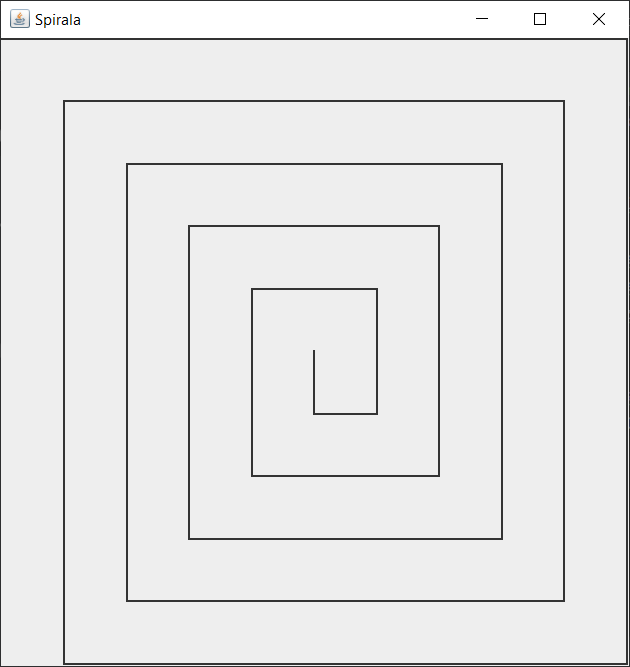

# Dokumentace ke kódu spirály

## Zadání:
- Vykreslit spirálu
- Vstup je
  - délka nejdelší strany (l)
  - velikost mezery mezi čárami (d)
- Využít rekurzi

## Řešení - výstup
l = 500, d = 50

l = 500, d = 11

## Popis řešení
Celý algoritmus je jednoduchá rekurzivní metoda, jejíž účelem je vykreslení jedné čáry ze spirály.
Jako vstupní parametry dostává počáteční souřadnice čáry (*X, Y*), změnu X (*deltaX*) a změnu Y (*deltaY*), a délku
kroku (*step*), což je vzdálenost mezi čárami. 

### 1)
Pomocí přičtení změny k aktuálním souřadnicím vypočítává následující souřadnice. Pokud je vzdálenost tohoto nového bodu menší než délka kroku, rekurze
končí, jelikož by po spojení počátečního a následujícího bodu vznikla čára, která by nesplňovala podmínku vzdálenosti
od ostatních čar.

### 2)
Vykreslení čáry probíhá pomocí Javové knihovny pro 2D grafiku Swing - zavoláním metody *drawLine()*, jejíž parametry jsou
právě počáteční a koncové souřadnice.

### 3)
Následně se vypočte nový rozdíl pro následující opětovné zavolání metody. Pokud byla aktuální změna provedena na ose X,
(kód vstupuje do podmínky *deltaX != 0*) např. *deltaX = 100* (nový bod leží o délku 100 vpravo oproti počátečnímu bodu),
následující čára musí být vykreslena směrem nahoru/dolů ve stejném "směru" (kladná/záporná změna), a tedy *deltaY* je
nastavena na aktuální hodnotu *deltaX* a *deltaX* je nastavena na 0.

Pokud byla aktuální změna provedena na ose Y (*deltaY != 0*), nové změně pro osu X (*deltaX*) je nastavena velikost
změny Y (*deltaY*) snížená o velikost kroku. Navíc se násobí *-1*, což zajišťuje "správný směr" vykreslení čáry.
A (*deltaY*) je nastavena na 0;

### 4)
Následuje už jen opětovné zavolání metody s právě vypočtenými parametry.

